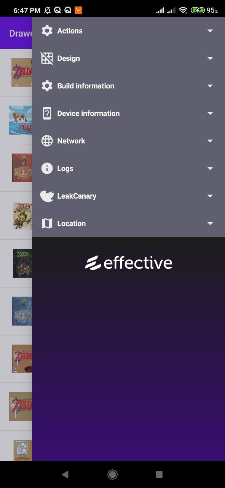
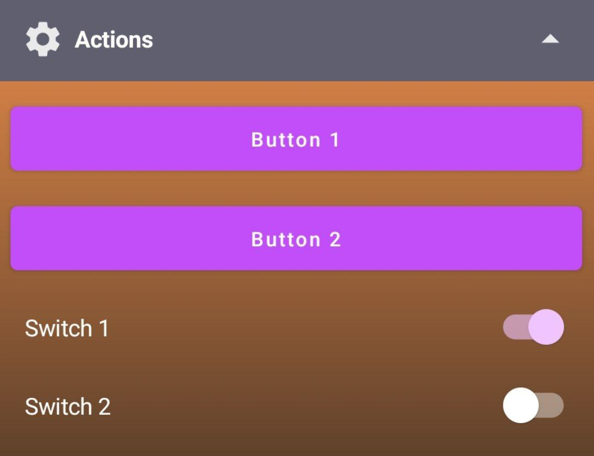
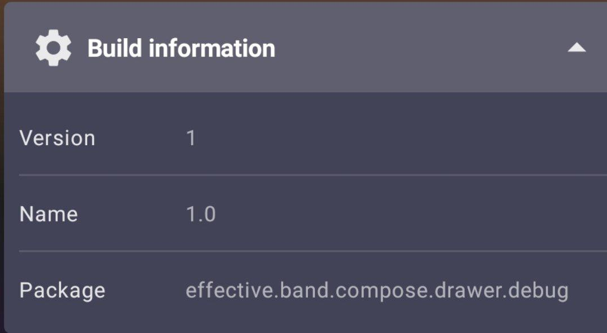
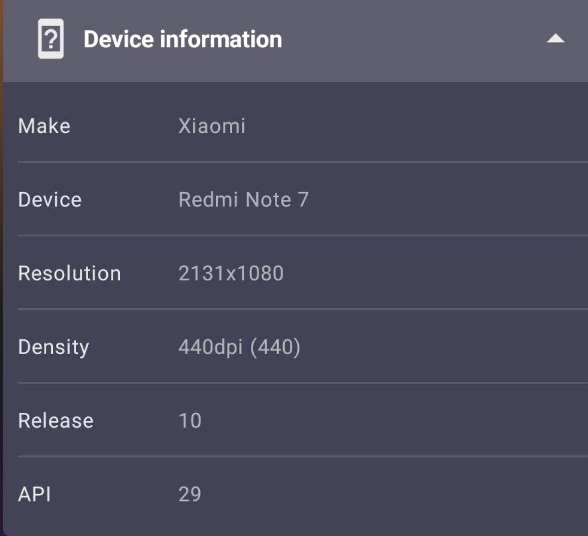
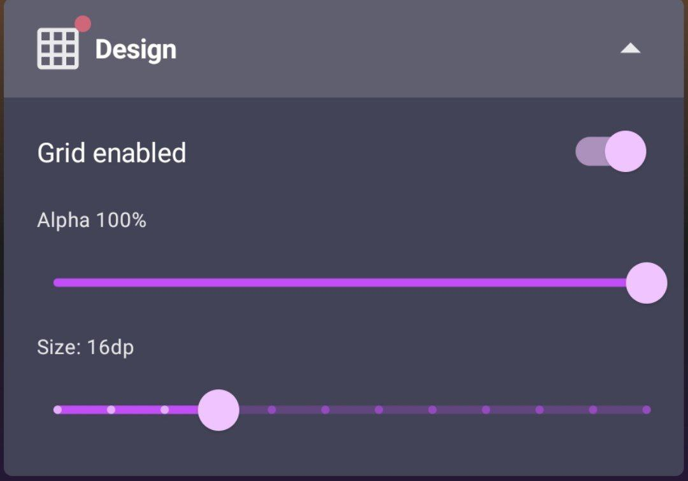
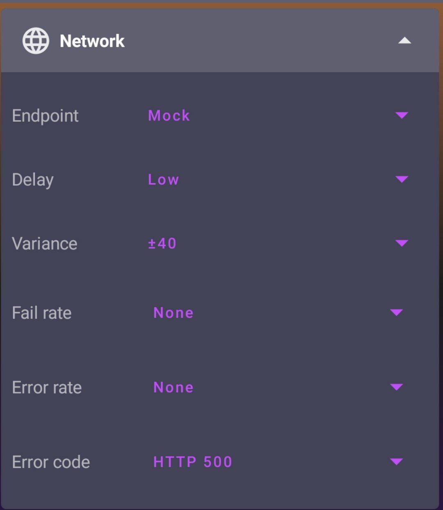
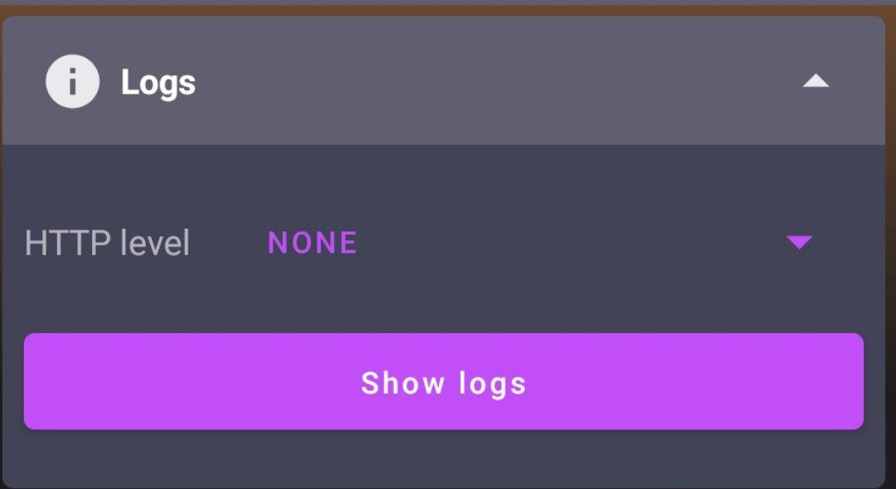
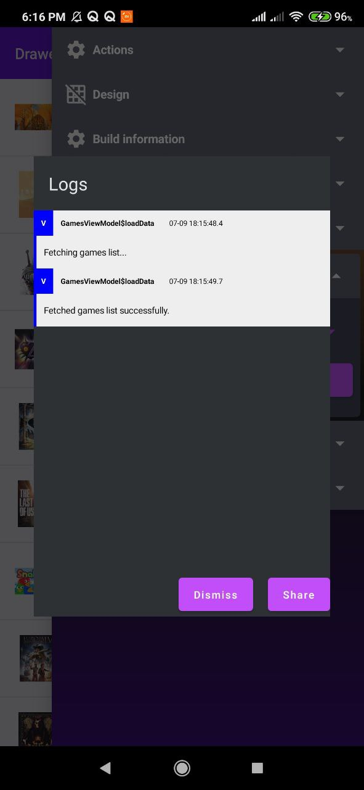
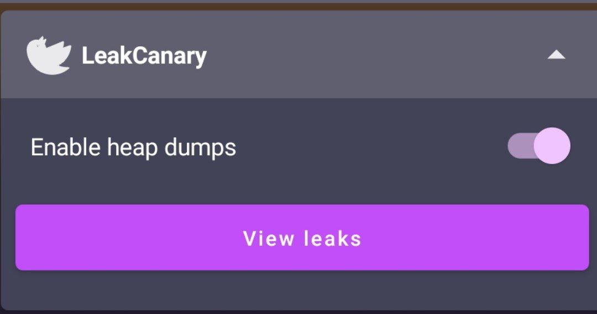
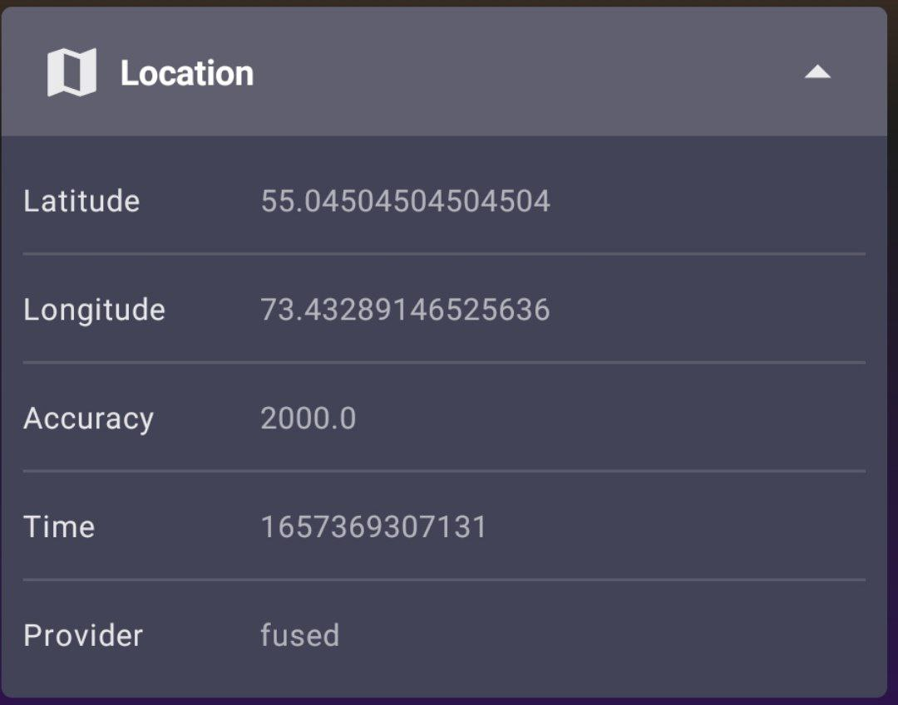

# Effective Debug Drawer for Jetpack Compose

Composable Debug Drawer for Jetpack Compose apps



## Install

Add mirror for maven repository:
```kotlin
repositories {
    //...
    maven {
        url = uri("https://mymavenrepo.com/repo/nFFsiSTFBS99YlQUZYju/")
    }
}
```

Add dependencies to `build.gradle.kts` of app:

```kotlin
dependencies{
    debugImplementation("effective.band:drawer:1.0.0")
    debugImplementation("effective.band:drawer-modules:1.0.0") {
        exclude("ComposeDrawer", "drawer-base")
        exclude("ComposeDrawer", "drawer-modules")
        exclude("null", "unspecified")
    }
    debugImplementation("effective.band:drawer-location:1.0.0")
}
```

## Setup

Wrap your content with `DebugDrawerLayout`:

```kotlin
DebugDrawerLayout(
    drawerModules = {
        TODO()
    }
) {
    // TODO Add your APP Content here
}
```

### Debug vs Release

If you don't want DebugDrawer layout code in release you can wrap it on a custom function:

`src/debug/...`

```kotlin
@Composable
fun ConfigureScreen(bodyContent: @Composable () -> Unit) {
    DebugDrawerLayout(
        drawerModules = { ... },
        bodyContent = { bodyContent() },
    )
}
```

`src/release/...`

```kotlin
@Composable
fun ConfigureScreen(bodyContent: @Composable () -> Unit) {
    bodyContent()
}
```

## Modules

Add modules as a list of `DebugModule`s

```kotlin
DebugDrawerLayout(
    debug = { BuildConfig.DEBUG },
    drawerModules = {
        DeviceModule()
        BuildModule()
    }
) {
    // TODO Add your APP Content here
}
```

#### Actions Module

This module has a composable slot.

You can build any of the provided actions, or build your own.



*Actions*

* ButtonAction: Shows a `Button` with given text, and register a lambda to receive its click

* SwitchAction: Shows a `Switch` and register a lambda to receive its changes

#### Build Module

Shows information about the app: Version code, Version name and Package



#### Device Module

Shows information about device running the app such as model and manufacturer



#### Design Module

Allows to show a Grid layer as overlay of your content, to help align content to grid




```kotlin
var debugGridLayerConfig: DebugGridStateConfig by remember {
    mutableStateOf(DebugGridStateConfig())
}

DebugDrawerLayout(
    drawerModules = {
        //...
        DesignModule(config = debugGridLayerConfig) {
            debugGridLayerConfig = it
        }
        //...
    },
    bodyContent = { drawerState ->
        Box {
            // Body of your app
            DebugGridLayer(debugGridLayerConfig)
        }
    },
)
```

#### Retrofit Module


Configuring [Retrofit](https://square.github.io/retrofit/) endpoints and mock network behaviour



To begin, you must create a list of
[`Endpoints`](https://gitlab.com/effectiveband/expertize/Android/compose-debug-drawer/-/blob/develop/drawer-modules/src/main/kotlin/effective/band/compose/drawer_modules/retrofit/Endpoint.kt).
This list might include entries such as `staging`, or `mock`.

Next, create an instance of
[`DebugRetrofitConfig`](https://gitlab.com/effectiveband/expertize/Android/compose-debug-drawer/-/blob/develop/drawer-modules/src/main/kotlin/effective/band/compose/drawer_modules/retrofit/DebugRetrofitConfig.kt).
This class takes care of persisting settings between app launches, and forwarding any runtime
modifications to `NetworkBehavior`. It also ensures that when you select a new `Endpoint` your
entire app process is restarted.

Finally, you can add
[`RetrofitModule`](https://gitlab.com/effectiveband/expertize/Android/compose-debug-drawer/-/blob/develop/drawer-modules/src/main/kotlin/effective/band/compose/drawer_modules/retrofit/RetrofitModule.kt)

```kotlin
var debugGridLayerConfig: DebugGridStateConfig by remember {
    mutableStateOf(DebugGridStateConfig())
}

DebugDrawerLayout(
    drawerModules = {
        //...
        RetrofitModule(
            modifier = modulesModifier,
            config = debugRetrofitConfig
        )
        //...
    },
    bodyContent = { drawerState ->
        Box {
            // Body of your app
            DebugGridLayer(debugGridLayerConfig)
        }
    },
)
```

#### OkHttpLogging Module

It can be incredibly useful to view HTTP requests and results when debugging your app. This module
provides a dropdown menu in the drawer to select what level of logging you'd like to see for your
HTTP requests. It relies on you using OkHttp as your HTTP client, and pipes its output into Timber.

To use it, first add
[HttpLogger.interceptor](https://gitlab.com/effectiveband/expertize/Android/compose-debug-drawer/-/blob/develop/drawer-modules/src/main/kotlin/effective/band/compose/drawer_modules/okhttp/HttpLogger.kt)
as an interceptor to your `OkHttpClient`. Then pass `HttpLogger` on to
[OkHttpLoggerModule](https://gitlab.com/effectiveband/expertize/Android/compose-debug-drawer/-/blob/develop/drawer-modules/src/main/kotlin/effective/band/compose/drawer_modules/okhttp/OkHttpLoggerModule.kt).





#### LeakCanary Module

Providing a more convenient entry into [LeakCanary](https://github.com/square/leakcanary)
LeakCanary is a fantastic tool for detecting memory leaks in your app. The only problem with it is
how it adds a launcher icon for each app you have installed that uses it. This module takes care of
removing that launcher icon and cages LeakCanary in the debug drawer. It also provides a handy
switch for toggling heap dumps on and off.



#### Location Module

Shows common location information (requires extra dependency)




#### Custom Module

Debug drawer can show any `@Composable` function.

If you want to provide a custom module that looks like the ones provided by the library:

```kotlin
@Composable
fun CustomModule(
    modifier: Modifier = Modifier,
    icon: @Composable (() -> Unit)? = null,
    title: String,
    showBadge: Boolean = false, 
    items: List<Pair<String, String>>
) {
    DebugDrawerModule(
        modifier = modifier,
        icon = icon,
        title = title,
        showBadge = showBadge,
    ) {
        // Module content
    }
}
```

## Theming && Customization

Use `drawerColors` to customize drawer theme colors.

```kotlin
DebugDrawerLayout(
    drawerColors = YourColorScheme, // darkColors() or lightColors()
)
```

If you want to modify the drawer colors, use `DebugDrawerDefaults.colors.copy(...)`

### Modules list UI

Update each module's UI by passing a `Modifier`

```kotlin
DebugDrawerLayout(
    drawerModules = {
        val modulesModifier = Modifier
            .padding(4.dp)
            .clip(shape = MaterialTheme.shapes.medium)
            .background(color = MaterialTheme.colors.surface)
        DeviceModule(modulesModifier)
        BuildModule(modulesModifier)
    }
)
```

Or configure the whole contents by specifying a `drawerContentModifier`

```kotlin
DebugDrawerLayout(
    drawerContentModifier = Modifier.padding(16.dp),
    drawerModules = {
        DeviceModule()
        BuildModule()
    }
)
```

## How to publish new version

Add publish credentials to `local.properties`:
```properties
myMavenRepoWriteUrl=https://link-to-maven-rep
username=username
password=password
```

Update the version in `buildSrc/src/main/kotlin/PublishConfig.kt`:
```kotlin
object PublishConfig {
    const val drawerVersion = "1.0.0"
    //...
}
```

Run `publish` task

## Known issues
- `exclude` in `drawer-modules` dependency